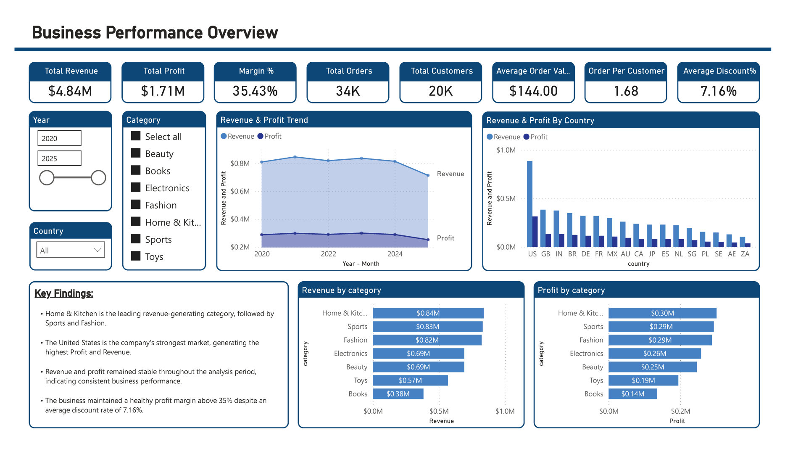
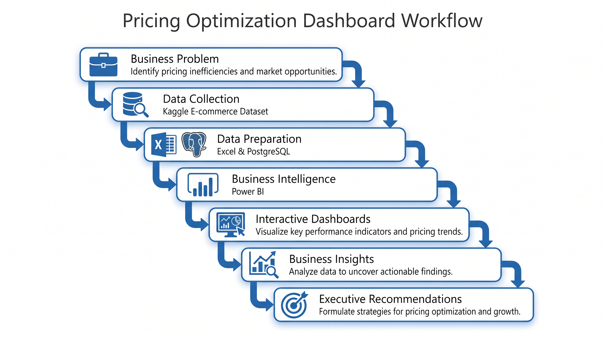
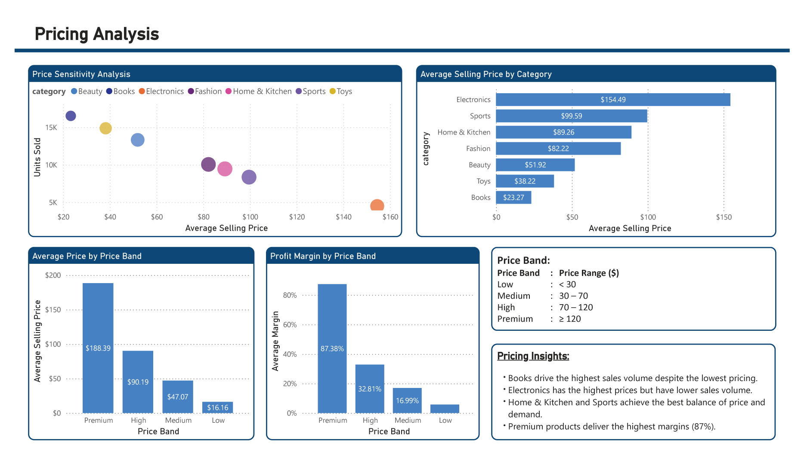
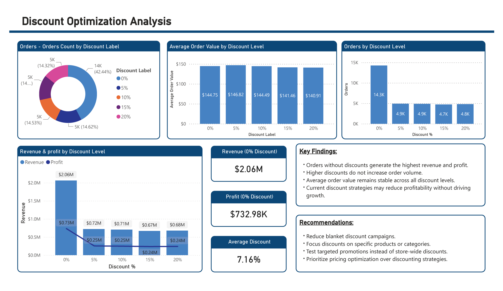
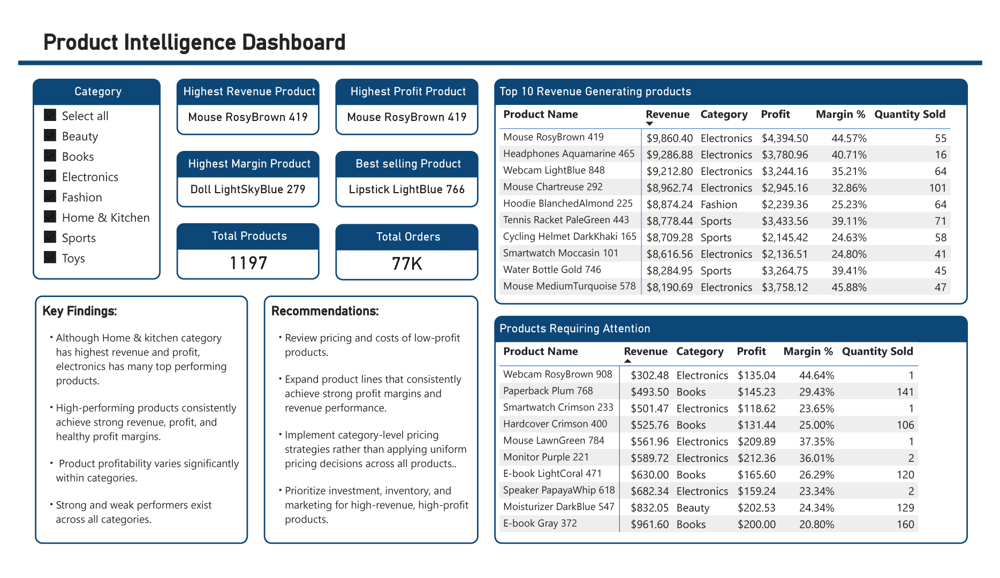
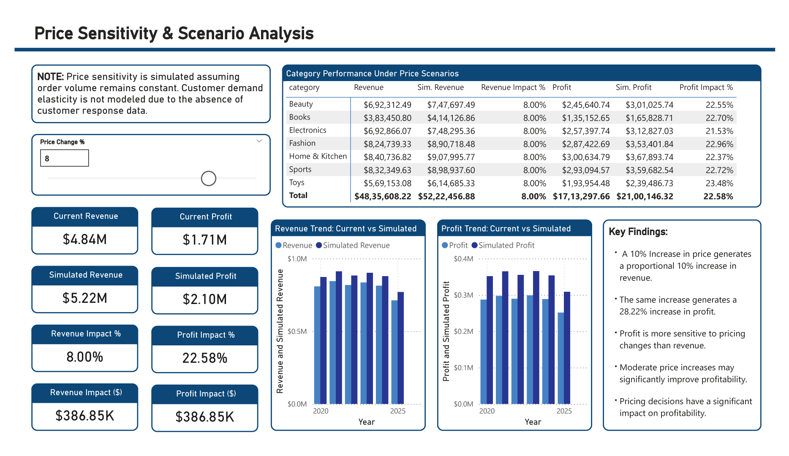
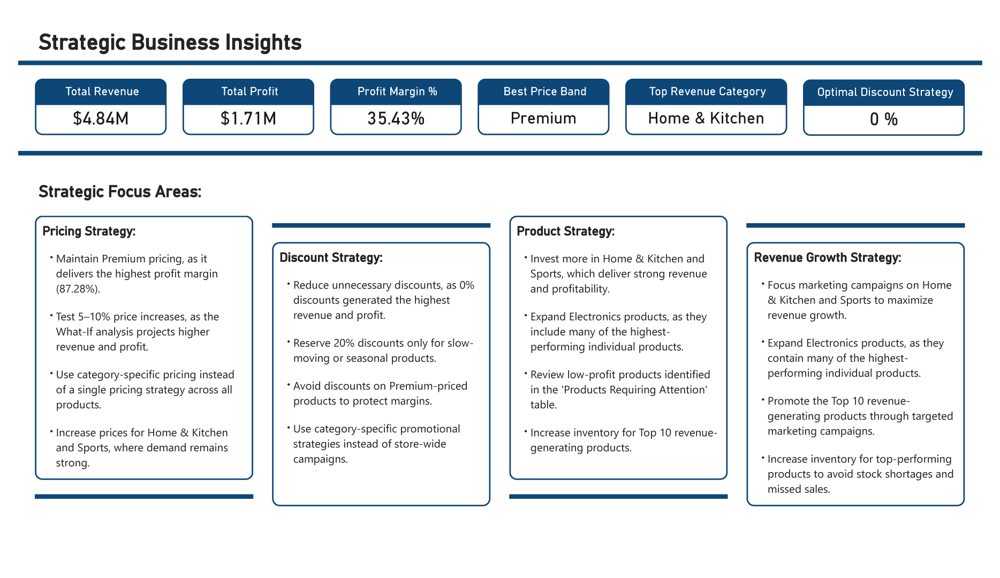
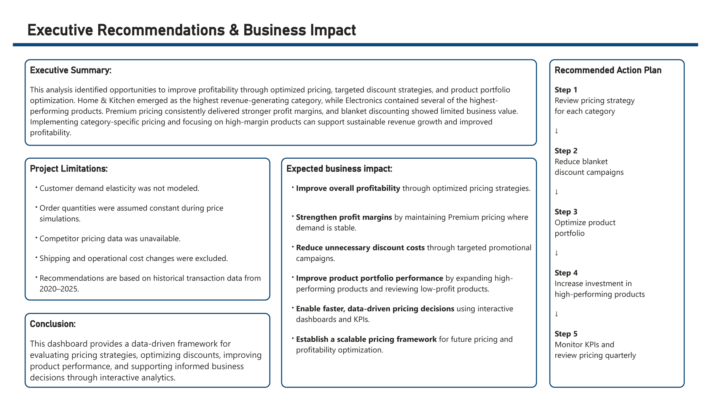

<h1 align="center">Pricing Optimization Dashboard</h1>

---

End-to-End Business Intelligence solution built using PostgreSQL, SQL, Excel, and Power BI.

---

  

---

## 🚀 Tech Stack

---

## 📑 Table of Contents

- [Project Overview](#-project-overview)
- [Business Problem](#-business-problem)
- [Project Workflow](#-project-workflow)
- [Dataset](#-dataset)
- [Tools & Technologies](#-tools--technologies)
- [Project Features](#-project-features)
- [Database Design](#-database-design)
- [Dashboard Showcase](#-dashboard-showcase)
- [Key Business Insights](#-key-business-insights)
- [Business Recommendations](#-business-recommendations)
- [Author](#-author)

---

## 📌 Project Overview

The **Pricing Optimization Dashboard** is an end-to-end Business Intelligence project developed to help an e-commerce business optimize pricing strategies, evaluate profitability, measure discount effectiveness, and monitor overall business performance.

Built using PostgreSQL, SQL, Excel, and Power BI, the project transforms raw transactional data into interactive dashboards that support pricing optimization, profitability analysis, and strategic business decision-making.

---

## 🎯 Business Problem

Despite having access to large volumes of transactional data, the e-commerce business lacked a centralized Business Intelligence solution to monitor performance and support strategic decision-making. As a result, pricing, discount, and profitability decisions were made without clear, data-driven insights.

The project was designed to answer key business questions such as:

- Is the business profitable?
- Which products and categories generate the highest revenue and profit?
- Are current pricing strategies effective?
- Do discounts improve profitability or reduce margins?
- Which products should be promoted, repriced, or discontinued?
- How would pricing changes impact future revenue and profit?

The final solution enables management to monitor business performance, evaluate pricing strategies, identify growth opportunities, and make informed business decisions through interactive dashboards.

---

## 🔄 Project Workflow

The project follows a structured Business Intelligence workflow, transforming raw e-commerce data into meaningful business insights through database design, SQL analysis, Power BI modeling, and interactive dashboards.

---

### End-to-End Workflow

  

---

## 📂 Dataset

This project uses a **publicly available synthetic e-commerce dataset** from **Kaggle**. Although the data is not from a real business, it closely resembles real-world e-commerce transactions, making it ideal for Business Intelligence and analytics projects.

---

### Dataset Summary

| Attribute | Details |
|-----------|---------|
| **Source** | Kaggle |
| **Type** | Synthetic E-commerce Dataset |
| **Period** | 2020 – 2025 |
| **Customers** | 20,000 |
| **Products** | 1,197 |
| **Orders** | 33,580 |
| **Order Items** | 59,163 |

---

### Dataset Used

The original dataset contains seven CSV files. This project focuses on the four core transactional datasets required for pricing and profitability analysis:

- Customers
- Products
- Orders
- Order Items

The remaining datasets (Sessions, Events, and Reviews) were outside the scope of this project.

---

## 🛠 Tools & Technologies

The project combines multiple tools to build a complete end-to-end Business Intelligence solution.

| Tool | Purpose |
|------|---------|
| **Excel** | Data review and validation |
| **PostgreSQL** | Database design and SQL analysis |
| **pgAdmin 4** | Database management |
| **Power BI Desktop** | Dashboard development |
| **Power Query** | Data transformation (ETL) |
| **DAX** | Measures, KPIs, and What-If Analysis |
| **VS Code** | SQL script development |
| **GitHub** | Version control and documentation |

---

## 📈 Key Features

- 📊 **7 Interactive Dashboard Pages**
- 🗄 **PostgreSQL Relational Database**
- 📈 **20+ SQL Business Queries**
- 📐 **Star Schema Data Model**
- ⚡ **20+ DAX Measures & KPIs**
- 🎯 **What-If Scenario Analysis**
- 💰 **Pricing & Profitability Analysis**
- 📦 **Product Performance Analysis**
- 🌍 **Country-wise Revenue Analysis**
- 💡 **Strategic Business Recommendations**

---

## 🗄 Database Design

The project uses a **PostgreSQL relational database** to store, organize, and analyze the e-commerce data. The raw CSV files were imported into PostgreSQL, where the database was structured using four core transactional tables and analytical SQL views to support business reporting.

---

### Core Tables

- Customers
- Products
- Orders
- Order Items

---

### SQL Views

- Category Performance
- Pricing Analysis
- Discount Analysis
- Monthly Trends
- Loss-Making Products

---

### PostgreSQL Database Walkthrough

The following recording demonstrates the database schema, SQL views, and sample business queries used in this project.

🎥 **PostgreSQL Database Walkthrough**

▶️ [Watch Database Walkthrough](Media/02_Postgres_SQL_view.mp4)

---

### Power BI Data Model

The dashboard follows a **Star Schema** data model, enabling efficient relationships, DAX calculations, and interactive reporting.

🎥 **Power BI Model View**

▶️ [View Model Walkthrough](Media/04_Model_View.mp4)

---

# 📊 Dashboard

The solution consists of **seven interactive dashboard pages**, each designed to answer a specific business question.

---

## 1️⃣ Business Performance Overview

**Purpose**

Provides an executive overview of revenue, profit, margin, customers, orders, product categories, and country-wise performance.

  

---

## 2️⃣ Pricing Analysis

**Purpose**

Evaluates pricing strategies across product categories to identify pricing opportunities.

  

---

## 3️⃣ Discount Optimization

**Purpose**

Measures the impact of discounts on revenue, profitability, and customer purchasing behavior.

  

---

## 4️⃣ Product Intelligence

**Purpose**

Identifies top-performing and low-performing products using profitability analysis.

  

---

## 5️⃣ Price Sensitivity & Scenario Analysis

**Purpose**

Uses What-If Analysis to simulate pricing changes and evaluate their impact on revenue and profitability.

  

---

## 6️⃣ Strategic Business Insights

**Purpose**

Summarizes analytical findings into actionable business insights.

  

---

## 7️⃣ Executive Recommendations

**Purpose**

Presents strategic recommendations, action plans, and expected business impact.

  

---

## 💡 Key Business Insights

The dashboard uncovered several insights that can support better pricing and profitability decisions:

- 🏆 **Home & Kitchen** generated the highest revenue, followed by **Sports** and **Fashion**.
- 🌍 The **United States** was the highest-performing market in both revenue and profit.
- 💰 The business achieved an overall **35.43% profit margin** while maintaining an average discount of **7.16%**.
- 🎯 Orders without discounts generated the highest profitability, indicating that blanket discount strategies may not always be effective.
- 📈 Premium-priced products consistently achieved higher profit margins than lower-priced alternatives.
- 🔄 Price Sensitivity Analysis showed that moderate price increases improved simulated profitability under constant-demand assumptions.
- 📦 Product performance varied significantly across categories, highlighting opportunities for pricing optimization and portfolio improvements.

---

## 🚀 Business Recommendations

Based on the analysis, the following recommendations were identified:

- Implement category-specific pricing strategies instead of a single pricing model.
- Replace blanket discounts with targeted promotional campaigns.
- Increase investment in high-performing product categories.
- Review and optimize low-performing products through repricing or portfolio rationalization.
- Continuously monitor business performance using interactive dashboards and KPIs.
- Evaluate pricing decisions using What-If Scenario Analysis before implementation.

---

## 📈 Business Impact

This dashboard enables decision-makers to:

- Improve pricing strategies using data-driven insights.
- Identify high-performing and underperforming products.
- Evaluate discount effectiveness before launching campaigns.
- Monitor business performance through executive KPIs.
- Simulate pricing decisions using What-If Analysis.
- Support strategic planning through actionable recommendations.

---

## 👤 Author

**Bhuvan G Naik**

Aspiring Business Analyst | Data Analyst | Business Intelligence Enthusiast

- 🔗 LinkedIn: https://www.linkedin.com/in/bhuvan-g-naik/
- 💻 GitHub: https://github.com/bhuvangnaik

---

⭐ If you found this project useful, consider giving it a star on GitHub.

---